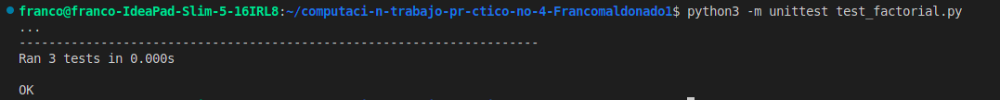

# Etapa 1: Factorial  

## Descripción del Problema: 

El objetivo de esta etapa es implementar dos versiones de la función factorial: una iterativa y otra recursiva.

## Instrucciones de ejecución:

1: Clonar el repositorio: git clone https://github.com/francomaldonado/computaci-n-trabajo-pr-ctico-no-4-Francomaldonado1.git si ingresamos a github con nuestro usuario y contraseña.

Si tenemos generada nuestra clave ssh, podemos clonar el repositorio con ssh: git clone git@github.com:francomaldonado/computaci-n-trabajo-pr-ctico-no-4-Francomaldonado1.git 

2: Entrar al directorio del proyecto: cd computaci-n-trabajo-pr-ctico-no-4-Francomaldonado1

3: Ejecutar el comando: python3 -m unittest test_factorial.py para ejecutar los test unitarios.

## Ejemplos de uso: 

### Usando la Función Iterativa  

from factorial import factorial_iterativo  

### Calcular el factorial de 5  
resultado = factorial_iterativo(5)  
print(f"El factorial de 5 es: {resultado}")  # Output: El factorial de 5 es: 120  

### Calcular el factorial de 0  
resultado = factorial_iterativo(0)  
print(f"El factorial de 0 es: {resultado}")  # Output: El factorial de 0 es: 1

## Captura de Resultados de los Tests  

A continuación se muestra una captura de los resultados de las pruebas unitarias:  

  

